# Karel

## Installation

Durch Öffnen des Projektes in [Pycharm](https://www.jetbrains.com/pycharm/) sollten alle Projektabhängigkeiten automatisch geladen werden. Falls es Probleme gibt, müsste die Installation manuell durchgeführt werden:

### Manuelle Installation (Windows)

 - Im Projektordner soll ein Virtual Environment angelegt werden: `python -m venv venv`
 - Das Virtual Environment soll aktiviert werden: `.\venv\Scripts\activate`
 - Installation der Projektabhängigkeiten: `pip install -r requirements.txt`

## Karel Funktionen

| Karel Funktionen     |                        |                          |
| -------------------- | ---------------------- | ------------------------ |
| `move()`             | `right_is_clear()`     | `facing_east()`          |
| `turn_left()`        | `right_is_blocked()`   | `not_facing_east()`      |
| `put_beeper()`       | `beepers_present()`    | `facing_west()`          |
| `pick_beeper()`      | `no_beepers_present()` | `not_facing_west()`      |
| `front_is_clear()`   | `beepers_in_bag()`     | `facing_south()`         |
| `front_is_blocked()` | `no_beepers_in_bag()`  | `not_facing_south()`     |
| `left_is_clear()`    | `facing_north()`       | `paint_corner(color)`    |
| `left_is_blocked()`  | `not_facing_north()`   | `corner_color_is(color)` |

## Aufgaben

### 01 Collect Newspaper

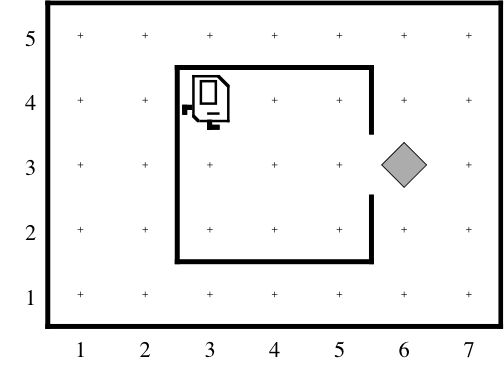

 1. Karel startet in seinem Lesesessel in seinem Haus
 2. Karel soll die Zeitung vor der Türe holen 
 3. Karel soll zurück an die Startposition geführt werden

### 02 Arches

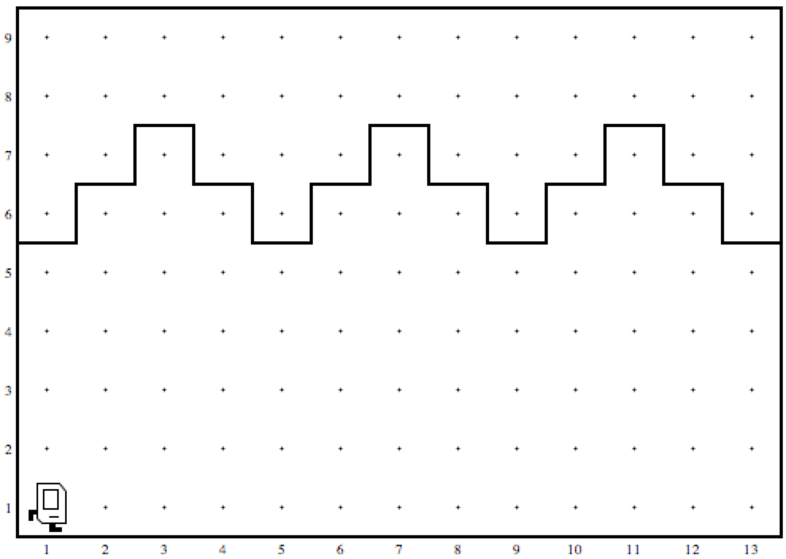

 1. Karel startet in der linken unteren Ecke
 2. Karel soll die Säulen des Gewölbes reparieren
 3. Karel endet an der rechten unteren Ecke

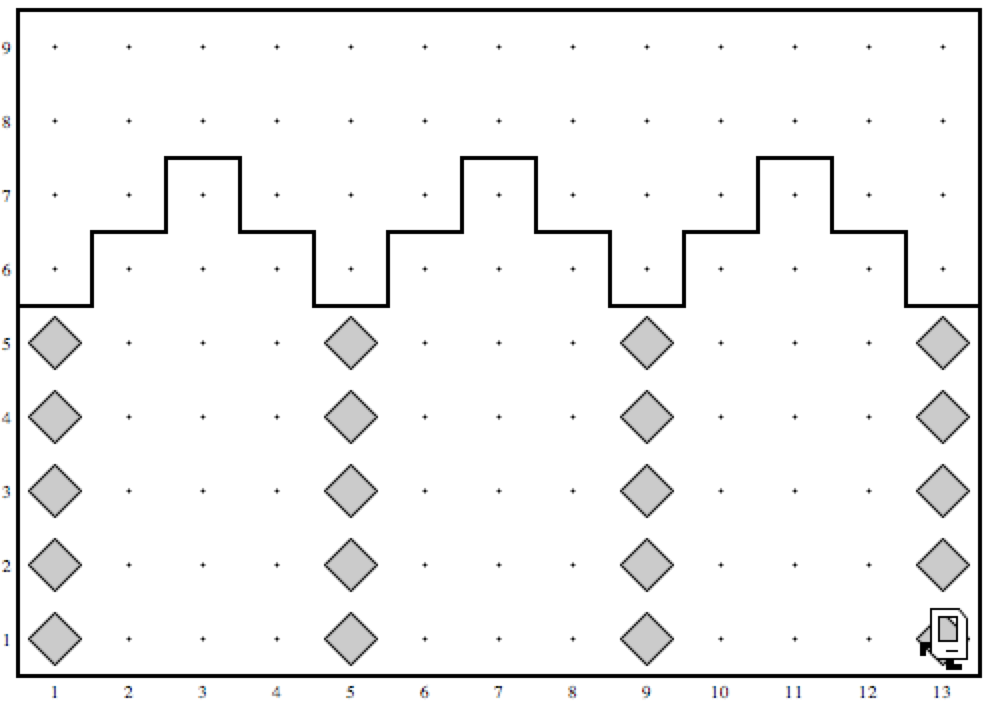

### 03 Squares

 1. Karel startet in der linken unteren Ecke
 2. Karel soll eine Mauer um die quadratische Welt bauen
 3. Karel endet in der Startposition (Drehung beachten)

Die Welt kann eine beliebige Größe haben

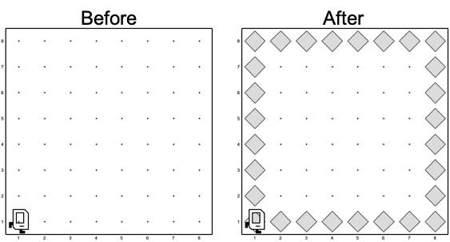
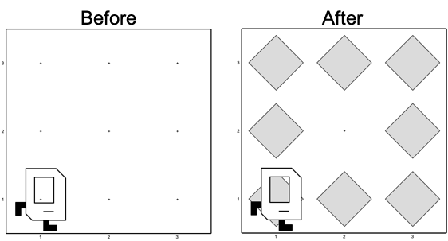

### 04 Mountains

 1. Karel startet in der linken unteren Ecke
 2. Karel soll auf den Berggipfel steigen
 3. Karel soll am Berggipfel einen Beeper ablegen
 4. Karel soll auf der anderen Seite den Berg absteigen

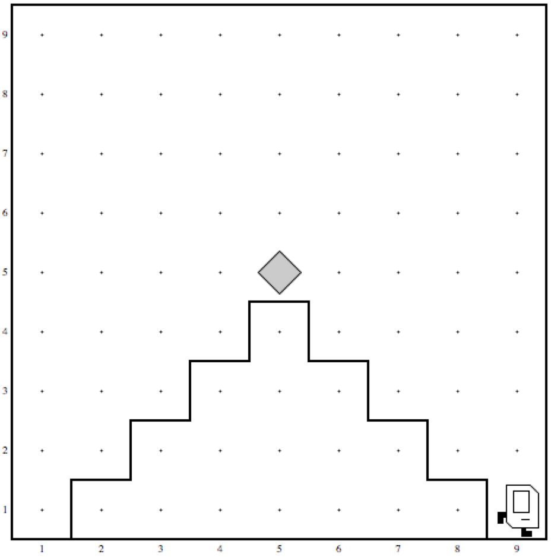

Die Welt kann eine beliebige Größe haben:

### 05 Treasure

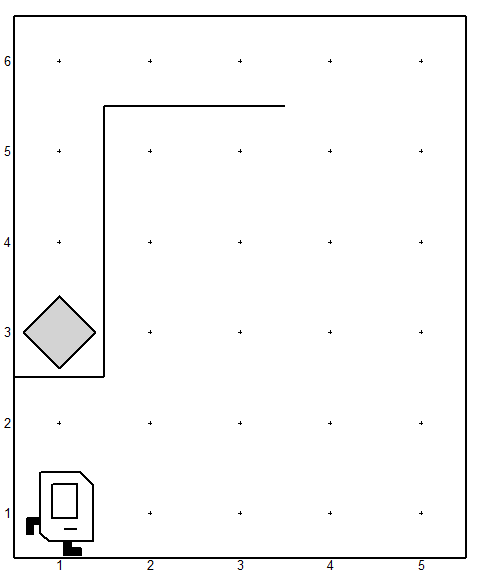

 1. Karel startet in der linken unteren Ecke
 2. Karel den Schatz heben
 3. Karel soll an die rechte untere Ecke gehen

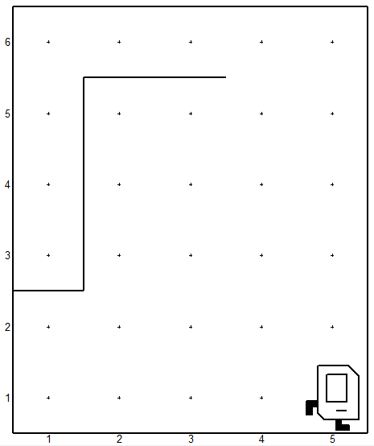

Die Welt kann eine beliebige Größe haben

### 06 Stripes

 1. Karel startet in der linken unteren Ecke
 2. Karel soll alle ungeraden Zeilen mit Beeper füllen
 3. Karel soll bis zur linken oberen Ecke wandern

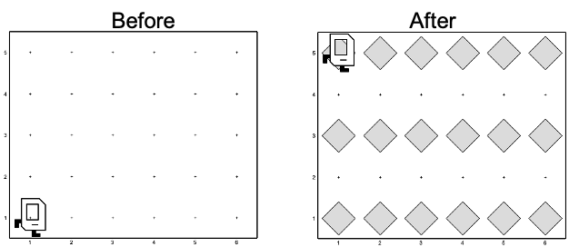

Die Welt kann eine beliebige Größe haben

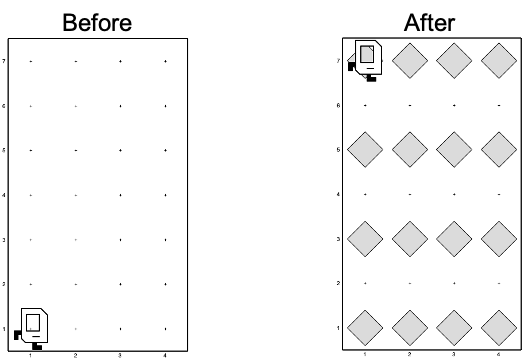

Die Welt kann auch Wände haben, welche nicht passierbar sind

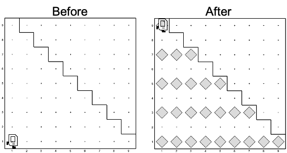

### 07 Random Colors

 1. Karel startet in der linken unteren Ecke
 2. Karel soll jede Zelle mit einer zufälligen Farbe tapezieren
 3. Karel endet in der rechten oberen Ecke

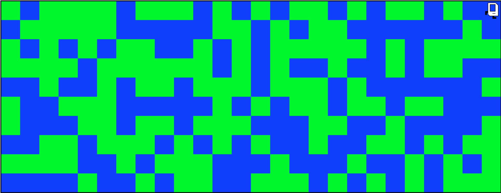

