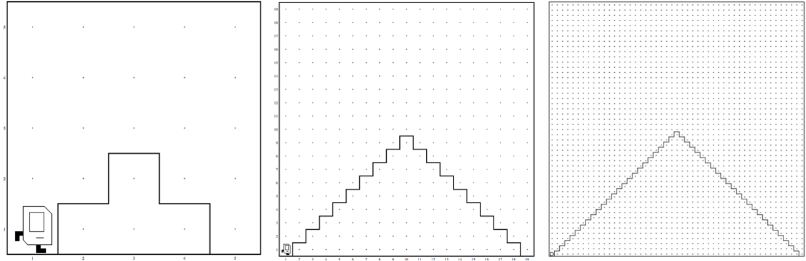
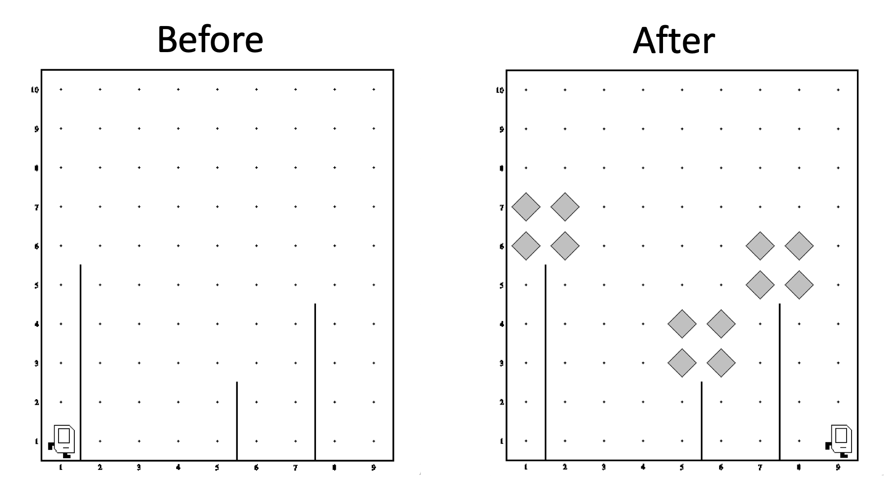

# Karel

## Installation

Durch Öffnen des Projektes in [Pycharm](https://www.jetbrains.com/pycharm/) sollten alle Projektabhängigkeiten automatisch geladen werden. Falls es Probleme gibt, müsste die Installation manuell durchgeführt werden:

### Manuelle Installation (Windows)

 - Im Projektordner soll ein Virtual Environment angelegt werden: `python -m venv venv`
 - Das Virtual Environment soll aktiviert werden: `.\venv\Scripts\activate`
 - Installation der Projektabhängigkeiten: `pip install -r requirements.txt`

## Karel Funktionen

### Bewegung 

| Funktion | Beschreibung |
| --- | --- |
| `move()` | Karel bewegt sich eine Zelle in Blickrichtung |
| `turn_left()` | Karel dreht sich 90° nach links |
| `front_is_clear()` | Karel prüft ob er nach vorne gehen kann |
| `front_is_blocked()` | Karel prüft ob er nicht nach vorne gehen kann |
| `left_is_clear()` | Karel prüft ob er nach links gehen kann |
| `left_is_blocked()` | Karel prüft ob er nicht nach links gehen kann |
| `right_is_clear()` | Karel prüft ob er nach rechts gehen kann |
| `right_is_blocked()` | Karel prüft ob er nicht nach links gehen kann |
| `facing_north()` | Karel prüft ob er nach oben schaut |
| `not_facing_north()` | Karel prüft ob er nicht nach oben schaut |
| `facing_east()` | Karel prüft ob er nach rechts schaut  |
| `not_facing_east()` | Karel prüft ob er nicht nach oben schaut  |
| `facing_west()` | Karel prüft ob er nach links schaut |
| `not_facing_west()` | Karel prüft ob er nicht nach links schaut |
| `facing_south()` | Karel prüft ob er nach unten schaut  |
| `not_facing_south()` | Karel prüft ob er nicht nach unten schaut |

### Beeper

| Funktion | Beschreibung |
| --- | --- |
| `put_beeper()` | Karel legt einen Beeper ab |
| `pick_beeper()` | Karel nimmt einen Beeper auf |
| `beepers_present()` | Karel prüft ob Beeper in der Zelle liegen |
| `no_beepers_present()` | Karel prüft ob keine Beeper in der Zelle liegen  |
| `beepers_in_bag()` | Karel prüft ob Beeper in seiner Tasche liegen |
| `no_beepers_in_bag()` | Karel prüft ob keine Beeper in seiner Tasche liegen |

### Farben

| Funktion | Beschreibung |
| --- | --- |
| `paint_corner(color)` | Karel färbt die Zelle mit der Farbe `color` |
| `corner_color_is(color)` | Karel prüft, ob die Zelle die Farbe `color` hat |

#### Farbwerte

 - `RED`
 - `BLACK`
 - `CYAN`
 - `DARK_GRAY`
 - `GRAY`
 - `GREEN`
 - `LIGHT_GRAY`
 - `MAGENTA`
 - `ORANGE`
 - `PINK`
 - `WHITE`
 - `BLUE`
 - `YELLOW`
 - `BLANK`

## Aufgaben

### 01 Hospital


 1. Karel startet in der linken unteren Ecke
 2. Karel soll bis zur rechten unteren Ecke wandern
 3. Alle Beeper die Karel findet, soll er in ein Hospital verwandeln
 4. Karel endet an der rechten unteren Ecke


### 02 Collect Newspaper


 1. Karel startet in seinem Lesesessel in seinem Haus
 2. Karel soll die Zeitung vor der Türe holen 
 3. Karel soll zurück an die Startposition geführt werden

### 03 Arches


 1. Karel startet in der linken unteren Ecke
 2. Karel soll die Säulen des Gewölbes reparieren
 3. Karel endet an der rechten unteren Ecke


### 04 Squares

 1. Karel startet in der linken unteren Ecke
 2. Karel soll eine Mauer um die quadratische Welt bauen
 3. Karel endet in der Startposition (Drehung beachten)

Die Welt kann eine beliebige Größe haben


### 05 Mountains


 1. Karel startet in der linken unteren Ecke
 2. Karel soll auf den Berggipfel steigen
 3. Karel soll am Berggipfel einen Beeper ablegen
 4. Karel soll auf der anderen Seite den Berg absteigen


Die Welt kann eine beliebige Größe haben:



### 06 Treasure


 1. Karel startet in der linken unteren Ecke
 2. Karel den Schatz heben
 3. Karel soll an die rechte untere Ecke gehen


Die Welt kann eine beliebige Größe haben

### 07 Stripes

 1. Karel startet in der linken unteren Ecke
 2. Karel soll alle ungeraden Zeilen mit Beeper füllen
 3. Karel soll bis zur linken oberen Ecke wandern


Die Welt kann eine beliebige Größe haben


Die Welt kann auch Wände haben, welche nicht passierbar sind


### 08 Invert

 1. Karel startet in der linken unteren Ecke
 2. Karel soll bis an die linke obere Ecke Wandern und alle Zeilen durchgehen
 3. Dabei soll Karel alle Beeper aufnehmen und in allen Zellen die leer sind einen Beeper ablegen (Welt invertieren)
 4. Karel endet in der linken oberen Ecke


### 09 Spring


 1. Karel startet in der linken unteren Ecke
 2. Karel soll bis in die rechte untere Ecke Wandern
 3. Alle Blumenstängel sollen mit einer Blume geschmückt werden
 4. Karel endet in der rechten unteren Ecke



### 10 Random Colors

 1. Karel startet in der linken unteren Ecke
 2. Karel soll jede Zelle mit einer zufälligen Farbe tapezieren
 3. Karel endet in der rechten oberen Ecke


## Welt Format

Zur Definition einer Karel Welt kann eine einfache Textdatei verwendet werden, welche die Dateiendung `.w` hat.

In der Datei befinden sich je Zeile Definitionen für die Welt. Die Welt orientiert sich an einem Koordinatensystem entlang der `x` bzw. `y` Achse. Der Ursprung des Koordinatensystems ist die Zelle links unten mit Koordinate `(1, 1)`.

 1. `Dimension: (x_len, y_len)` Mit dieser Zeile wird die Weltgröße definiert (`x_len`, `y_len` sind zu setzen)
 2. `Karel: (x, y); orientation` Mit `x` und `y` wird die Koordinate von Karel definiert, mit `orientation` (`west`, `east`, `south`, `north`) wird die Himmelsrichtung definiert, in die Karel blickt.
 3. `Beeper: (x, y); count` Mit `x` und `y` wird die Koordinate eines Beeper definiert, mit `count` wird die Anzahl der Beeper definiert (zB `1`)
 4. `Wall: (x, y); orientation` Mit `x` und `y` wird die Koordinate der Zelle definiert, in der die Wand platziert werden soll. Mit `orientation` wird die Position der Wand mit Referenz zur Zelle definiert (`west`, `east`, `south`, `north`). Mit `west` würde die Wand an der linken Seite der Zelle platziert.
 5. `BeeperBag: count` Mit `count` wird die Anzahl der Beeper in Karel’s Tasche definiert, entweder eine Ganzzahl oder der Wert `INFINITY` 

### Beispiel

```text
Dimension: (5, 6)
Wall: (1, 3); south
Wall: (1, 4); east
Wall: (1, 5); east
Wall: (2, 3); west
Wall: (2, 5); north
Wall: (3, 5); north
Beeper: (1, 3); 1
Karel: (1, 1); east
BeeperBag: INFINITY
```
